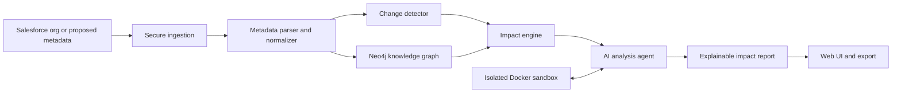

# Salesforce Metadata Impact Analysis System

An AI-assisted platform for understanding the impact of Salesforce metadata changes before they are deployed.

The finished product will connect to a Salesforce org, build a searchable knowledge graph of metadata and dependencies, detect proposed changes, identify everything those changes can affect, calculate explainable risk, and let an AI agent investigate the result inside an isolated Docker sandbox. The goal is to turn a question such as **"What could break if I change this field?"** into a dependable, evidence-backed report.

> This project is under active development. This README describes both the final product vision and the functionality available today. Planned features are clearly marked and should not be treated as implemented.

## The Problem

A Salesforce change rarely exists in isolation. A field can be used by a Flow, Apex trigger, validation rule, permission set, report, formula, Lightning page, or another automation. Manually finding those relationships is slow, and missing one can cause a failed deployment or a production incident.

This system is intended to answer:

- What metadata is changing?
- Which components depend directly on it?
- Which components are affected indirectly through a dependency chain?
- Why is each component considered impacted?
- How risky is the change, and what contributes to that score?
- What should be reviewed or tested before deployment?
- Can an AI agent safely inspect the metadata and produce a useful report?

## Final Product Experience

When the project is complete, a user will be able to:

1. Sign in securely with Salesforce.
2. Select an org, package, pull request, deployment ZIP, or metadata snapshot to analyze.
3. Retrieve and normalize the relevant Salesforce metadata.
4. Compare a baseline with the proposed version to detect added, modified, and deleted components.
5. Build or update a Neo4j knowledge graph containing components and their dependency relationships.
6. Run impact analysis across every detected change, including direct and multi-hop dependencies.
7. Ask an AI agent questions in plain English, such as:
   - "What will be affected if `Account.Status__c` is deleted?"
   - "Which Flows and Apex triggers should I test?"
   - "Explain why this deployment is high risk."
8. Allow the agent to inspect files and run approved analysis commands in a session-specific Docker sandbox.
9. Review an explainable report containing evidence, dependency paths, risk, warnings, and recommended tests.
10. Export or share the report as part of a deployment review process.

## Target Workflow



The core design follows a **compute-to-data** approach: Salesforce metadata is placed in a restricted analysis environment, and the agent receives controlled tools to inspect it. The agent does not receive unrestricted access to the host machine.

## Project Status

The backend foundation is working locally. Metadata can be retrieved from Salesforce, parsed, persisted as a Neo4j graph, and analyzed for the impact of one specified component change. The automatic change-detection layer, conversational agent, finished report, and frontend are still to be built.

| Area | Status | What exists today |
| --- | --- | --- |
| Salesforce OAuth | Implemented for local MVP | OAuth 2.0 Web Server flow with PKCE |
| Metadata retrieval | Implemented | Asynchronous Metadata API retrieve and ZIP download |
| Secure ZIP ingestion | Implemented | Validates paths, links, duplicates, file counts, and expanded size |
| Session sandbox | Implemented | One persistent, isolated Docker container per analysis session |
| Metadata parsing | Partially implemented | Objects, fields, Apex classes, Apex triggers, Flows, and permission sets |
| Knowledge graph | Implemented for supported types | Session-namespaced nodes and relationships in Neo4j |
| Impact traversal | Implemented | Direct and indirect dependency traversal with paths |
| Risk scoring | Initial version implemented | Deterministic score with human-readable reasons |
| Automatic change detection | Planned | Compare snapshots, Git changes, or deployment archives |
| AI agent | Planned | Natural-language investigation using graph and sandbox tools |
| Analysis report | Planned | Consolidated findings, evidence, warnings, and test recommendations |
| Web application | Planned | Org connection, change selection, graph exploration, and reports |
| Production platform | Planned | Durable sessions, jobs, users, authorization, audit logs, and deployment |

## What Is Implemented

### 1. Salesforce connection and retrieval

- Generates a Salesforce authorization URL with PKCE and CSRF state.
- Exchanges the callback authorization code for Salesforce tokens.
- Starts an asynchronous Salesforce Metadata API retrieve job.
- Polls until the job succeeds or fails, then downloads the metadata ZIP.
- Currently requests `CustomObject`, `ApexClass`, `ApexTrigger`, `Flow`, and `PermissionSet` metadata.

### 2. Secure metadata ingestion

- Creates a dedicated sandbox session after Salesforce authentication.
- Safely extracts the retrieved archive into `/workspace/metadata`.
- Rejects absolute paths, parent-directory traversal, symbolic links, duplicate paths, malformed ZIPs, oversized files, and archives exceeding configured limits.
- Writes normalized parser output to `/workspace/analysis/parsed_metadata.json`.

### 3. Docker sandbox sessions

Each analysis session receives one persistent Docker container and workspace. Commands within that session see the same files until the session ends.

Current restrictions include:

- No network access.
- Non-root execution.
- Read-only container filesystem, except for the mounted workspace and limited `/tmp`.
- One CPU, 512 MB memory, and 128-process limits.
- Dropped Linux capabilities and `no-new-privileges`.
- Direct argument execution without a shell.
- An allowlist containing `cat`, `find`, `ls`, `pwd`, `python`, `python3`, `pytest`, and `rg`.
- A maximum command timeout of 60 seconds.
- Automatic cleanup after 30 minutes of inactivity and on application shutdown.

### 4. Metadata normalization

The parser converts Salesforce files into a common representation:

- **Component nodes** identify metadata by a stable key, type, name, source path, and attributes.
- **Reference edges** record which component uses another component, with source evidence where available.
- **Placeholder nodes** preserve references to components that were not included in the retrieved package.

### 5. Neo4j knowledge graph

- Uses Neo4j as the production graph backend.
- Stores each component as a `MetadataComponent` node.
- Stores dependencies as `METADATA_RELATION` relationships.
- Namespaces all graph records by sandbox session so concurrent analyses do not mix data.
- Uses parameterized Cypher and a uniqueness constraint on graph keys.
- Removes a session's graph when its sandbox session is destroyed.
- Retains a lightweight SQLite repository only as an isolated test adapter.

Conceptually, the graph can contain relationships such as:

```text
Flow:Update_Account        --REFERENCES_FIELD--> CustomField:Account.Status__c
ApexTrigger:AccountTrigger --REFERENCES_CLASS--> ApexClass:AccountService
PermissionSet:Sales_User   --GRANTS_FIELD_ACCESS--> CustomField:Account.Status__c
CustomObject:Account       --HAS_FIELD--> CustomField:Account.Status__c
```

### 6. Impact analysis

Given a component key and change type (`add`, `modify`, or `delete`), the engine:

- Finds components that depend directly on the change.
- Traverses indirect dependencies up to a configurable depth.
- Records the parent and relationship responsible for each impact.
- Calculates a deterministic risk score from 0 to 100.
- Classifies the result as `low`, `medium`, `high`, or `critical`.
- Explains the score using the change type, dependency count, and affected automation.

## Planned Scope

### Phase 1: Change detection

The next major capability will identify changes automatically instead of requiring a caller to provide one component key manually.

Planned inputs:

- Two Salesforce metadata snapshots: baseline and proposed.
- A Git branch or pull-request diff.
- A deployment ZIP or package directory.
- A manually selected set of components.

Planned output:

```json
[
  {
    "component_key": "CustomField:Account.Status__c",
    "change_type": "modify",
    "changed_properties": ["valueSet"]
  }
]
```

### Phase 2: Broader dependency coverage

The parser and graph will be expanded to understand more Salesforce metadata, including:

- Validation rules and formulas.
- Workflow rules, Process Builder artifacts, and additional Flow references.
- Profiles, permission-set groups, and object permissions.
- Lightning pages and Lightning Web Components.
- Aura components and Visualforce.
- Layouts, compact layouts, record types, and business processes.
- Reports, dashboards, email templates, and custom labels.
- Custom metadata, custom settings, named credentials, and integrations.
- Queues, groups, roles, sharing rules, and approval processes.
- Apex semantic references beyond basic source matching.

### Phase 3: Multi-change impact engine

- Analyze an entire deployment as one change set.
- Merge overlapping dependency paths.
- Detect deletion hazards and missing dependencies.
- Highlight order-of-execution and automation interactions.
- Separate confirmed dependencies from inferred references.
- Support configurable risk policies for each organization.
- Recommend focused Apex tests, Flow tests, regression areas, and manual checks.

### Phase 4: AI analysis agent

The agent will combine structured tools instead of relying only on model memory. Planned tools include:

- Query a component or dependency path in Neo4j.
- Request impact analysis for one component or a full change set.
- Search and read metadata files in the session workspace.
- Run approved local analysis scripts inside the Docker sandbox.
- Read parser evidence and compare metadata versions.
- Produce a structured report with citations back to files, nodes, and relationships.

The model will not receive arbitrary Docker or host access. All commands will pass through the existing policy, timeout, output, and lifecycle controls.

### Phase 5: Reports and web UI

The finished interface is expected to include:

- Salesforce org connection and session status.
- Analysis source selection.
- A detected-change list with filtering and severity.
- Interactive direct and indirect dependency exploration.
- Risk summaries and evidence for every finding.
- Natural-language questions about the deployment.
- Recommended validation and testing checklist.
- Exportable JSON and human-readable reports.
- Analysis history and comparison between runs.

### Phase 6: Production readiness

- Application users, organizations, roles, and authorization.
- Encrypted Salesforce token storage and refresh-token rotation.
- Durable OAuth state in Redis or another session store.
- PostgreSQL for analysis records, reports, and audit history.
- A background job queue for retrieval, parsing, and long analyses.
- Session quotas, cancellation, retries, observability, and failure recovery.
- Container isolation appropriate for the deployment environment.
- Secret management, TLS, rate limiting, audit logs, and retention controls.
- Automated CI, security checks, migrations, backups, and deployment manifests.

## Architecture

### Current local architecture

```text
Browser
  |
  | OAuth and REST
  v
FastAPI application
  |-- Salesforce OAuth + Metadata API client
  |-- ingestion pipeline
  |-- metadata parsers
  |-- impact analysis service
  |-- sandbox lifecycle manager
  |
  | Bolt                              Docker exec / bind mount
  v                                   v
Neo4j container                 Session sandbox container
(persistent graph volumes)      (/workspace, no network)
```

### Intended production architecture

```text
Web client
  |
API and authentication service
  |-- PostgreSQL: users, analyses, reports, audit history
  |-- Redis/queue: sessions and background work
  |-- Neo4j: metadata dependency graphs
  |-- Sandbox workers: isolated agent computation
  |-- Salesforce APIs: source metadata
  `-- Model provider: tool-using analysis agent
```

## Local Development

### Prerequisites

- Docker Desktop with Docker Compose.
- Python 3.11 or later.
- A Salesforce Connected App when testing real-org ingestion.
- Ports `8000`, `7474`, and `7687` available locally.

### 1. Clone and enter the repository

```bash
git clone <repository-url>
cd Salesforce-Metadata-Impact-Analysis-System-v2
```

### 2. Create a Python environment

```bash
python3 -m venv .venv
source .venv/bin/activate
python -m pip install -r requirements.txt
```

### 3. Configure Salesforce

Create a `.env` file in the repository root:

```dotenv
SF_CLIENT_ID=your_connected_app_consumer_key
SF_CLIENT_SECRET=your_connected_app_consumer_secret
SF_REDIRECT_URI=http://127.0.0.1:8000/auth/callback
SF_API_VERSION=59.0
SF_LOGIN_DOMAIN=login

NEO4J_MODE=local
NEO4J_LOCAL_URI=bolt://127.0.0.1:7687
NEO4J_LOCAL_USER=neo4j
NEO4J_LOCAL_PASSWORD=salesforce-impact-local
NEO4J_DATABASE=neo4j
```

Use `SF_LOGIN_DOMAIN=test` for a Salesforce sandbox org. The Connected App callback URL must exactly match `SF_REDIRECT_URI`.

For a remote Neo4j deployment, set `NEO4J_MODE=remote` and provide `NEO4J_URI`, `NEO4J_USERNAME`, and `NEO4J_PASSWORD`. Local mode ignores those remote values.

### 4. Build the agent sandbox image

```bash
docker build --tag salesforce-agent-sandbox:latest sandbox
```

### 5. Start Neo4j

```bash
docker compose up -d neo4j
```

Local services:

- Neo4j Browser: `http://127.0.0.1:7474`
- Neo4j Bolt: `bolt://127.0.0.1:7687`
- Default development username: `neo4j`
- Default development password: `salesforce-impact-local`

Override the local password by setting `NEO4J_LOCAL_PASSWORD` before starting Compose.

### 6. Start the API

```bash
uvicorn main:app --reload
```

Open:

- Application: `http://127.0.0.1:8000`
- Interactive API documentation: `http://127.0.0.1:8000/docs`

Select **Sign in with Salesforce** on the home page to run the current ingestion flow.

## Current API

| Method | Endpoint | Purpose |
| --- | --- | --- |
| `GET` | `/auth/salesforce` | Start Salesforce OAuth |
| `GET` | `/auth/callback` | Complete OAuth and run metadata ingestion |
| `POST` | `/sandbox/sessions` | Create an empty persistent sandbox session |
| `GET` | `/sandbox/sessions/{session_id}` | Read session lifecycle information |
| `POST` | `/sandbox/sessions/{session_id}/commands` | Run one allowed command in the sandbox |
| `GET` | `/sandbox/sessions/{session_id}/metadata` | Read normalized metadata |
| `GET` | `/sandbox/sessions/{session_id}/graph` | Read graph counts and type summaries |
| `POST` | `/sandbox/sessions/{session_id}/impact` | Analyze one proposed component change |
| `DELETE` | `/sandbox/sessions/{session_id}` | Destroy the container, workspace, and graph data |

### Example impact request

```bash
curl -X POST http://127.0.0.1:8000/sandbox/sessions/SESSION_ID/impact \
  -H 'Content-Type: application/json' \
  -d '{
    "component_key": "CustomField:Account.Status__c",
    "change_type": "modify",
    "max_depth": 5
  }'
```

### Example sandbox command

```bash
curl -X POST http://127.0.0.1:8000/sandbox/sessions/SESSION_ID/commands \
  -H 'Content-Type: application/json' \
  -d '{
    "program": "rg",
    "arguments": ["Status__c", "metadata"],
    "timeout_seconds": 30
  }'
```

### Python sandbox example

```python
from src.sandbox import DockerSandbox

with DockerSandbox() as sandbox:
    sandbox.execute(["python", "-c", "open('hello.txt', 'w').write('hello')"])
    result = sandbox.execute(["cat", "hello.txt"])
    print(result.stdout)
```

The reusable agent-facing command schema is exposed as `src.sandbox.tools.RUN_COMMAND_TOOL`. `SandboxToolAdapter` binds that tool to an existing session and applies the same policy as the HTTP API.

## Data Lifecycle

For the current local MVP:

1. OAuth succeeds and metadata is retrieved from Salesforce.
2. A Docker sandbox and host-mounted workspace are created for the session.
3. Metadata is extracted and normalized in that workspace.
4. Graph nodes and relationships are written to Neo4j under the session ID.
5. API and future agent calls reuse the same session data.
6. After 30 minutes of inactivity, explicit deletion, or application shutdown, the sandbox, workspace, and corresponding graph are removed.

Neo4j itself uses Docker named volumes, but session graph records are intentionally deleted with the analysis session in the current design. Durable analysis history is part of the production roadmap.

## Repository Layout

```text
.
|-- main.py                         FastAPI entrypoint
|-- compose.yaml                    Local Neo4j service
|-- sandbox/Dockerfile              Restricted agent runtime image
|-- src/api/                        HTTP routes, schemas, and application lifecycle
|-- src/auth/                       Salesforce OAuth and token models
|-- src/metadata_api/               Salesforce Metadata API retrieval
|-- src/metadata_parser/            Metadata normalization and reference extraction
|-- src/knowledge_graph/            Graph construction, Neo4j repository, test adapter
|-- src/impact_analysis/            Dependency traversal and risk scoring
|-- src/pipeline/                    End-to-end ingestion orchestration
|-- src/sandbox/                     Docker session lifecycle and command policy
`-- tests/                           Unit and integration-style tests
```

## Testing

Run the complete test suite:

```bash
python -m unittest discover -s tests -v
```

The suite covers sandbox lifecycle and policy, secure archive extraction, metadata parsing, ingestion orchestration, graph construction and traversal, Neo4j repository behavior, impact analysis, and API endpoints.

Real Salesforce validation requires a configured Connected App and access to an org. Real Neo4j validation requires the local Compose service or a configured remote database.

## Security Model

The Docker sandbox is a defense-in-depth boundary for local development, not a claim of complete multi-tenant production isolation. Before public deployment, the project must add authenticated API access, authorization checks, encrypted secrets, durable per-user OAuth state, stronger worker isolation, request quotas, monitoring, and a formal threat review.

Important current properties:

- Salesforce authorization uses PKCE.
- Sandbox commands are allowlisted and do not invoke a shell.
- Containers have no network and run without root or Linux capabilities.
- Metadata archive extraction validates untrusted ZIP content.
- Graph queries use parameterized Cypher.
- Session data is namespaced and cleaned up with the session.

Never expose the current development API directly to the public internet.

## Definition of Done

The project will be considered functionally complete when a user can connect a Salesforce org, provide or select a proposed metadata change set, automatically detect all changes, build a sufficiently broad dependency graph, receive accurate direct and indirect impact findings, investigate them through a controlled AI agent, and review an explainable report with evidence and test recommendations in a usable web interface.

Production completion additionally requires secure multi-user access, durable storage, background processing, observability, deployment automation, and validation against representative real Salesforce organizations.

## Roadmap Order

The recommended implementation sequence from the current state is:

1. Automatic metadata change detection and batch impact analysis.
2. Expanded Salesforce metadata and dependency parsers.
3. End-to-end validation against representative Salesforce orgs.
4. Tool-using AI agent connected to Neo4j and the Docker sandbox.
5. Structured report generation and test recommendations.
6. Web interface for analysis, graph exploration, and reports.
7. Persistent application data, background jobs, authentication, and production hardening.
